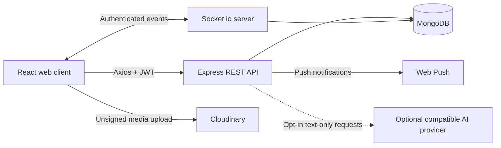

# Aura — Real-Time Communication Platform

[](https://aura-chat-topaz.vercel.app/)
[](https://aura-backend-lu3g.onrender.com/)
[](#technology-stack)
[](LICENSE)

Aura is a full-stack, real-time communication platform built to demonstrate production-minded web engineering with the MERN stack and Socket.io. It combines responsive chat experiences, direct and group conversations, rich media, message workflows, privacy controls, theme customization, and database-backed persistence in one cohesive application.

> **Portfolio project:** Aura is intentionally positioned as an intermediate-to-advanced demonstration project. Its core chat experience is deployed and usable, while enterprise operations such as long-term backup storage, large-scale load testing, and centralized observability remain optional extensions.

## Live demo

| Environment | Link | Purpose |
|---|---|---|
| **Web application** | [aura-chat-topaz.vercel.app](https://aura-chat-topaz.vercel.app/) | Responsive React frontend |
| **Backend API** | [aura-backend-lu3g.onrender.com](https://aura-backend-lu3g.onrender.com/) | Express and Socket.io service |
| **Health check** | [/health/live](https://aura-backend-lu3g.onrender.com/health/live) | Process liveness |
| **Database readiness** | [/health/ready](https://aura-backend-lu3g.onrender.com/health/ready) | Application and MongoDB readiness |
| **Source repository** | [github.com/almuyed-saad/aura-chat](https://github.com/almuyed-saad/aura-chat) | Source code and engineering history |

Render’s free tier may briefly cold-start after inactivity. The public demo is intended for portfolio exploration rather than guaranteed enterprise availability.

## Why this project is worth exploring

Aura demonstrates the engineering decisions behind a modern messaging product rather than only a message input and a database table. The application handles authenticated real-time communication, reconnection-sensitive state, optimistic user interactions, delivery feedback, group permissions, media metadata, responsive layouts, and theme-aware interface states.

The repository history is organized into reviewable releases. Stability and security were addressed before daily chat workflows, rich communication, product expansion, history performance, and visual polish. This sequence makes the project easier to review and shows how a working prototype can be progressively strengthened without directly rewriting the default branch for every experiment.

## Feature overview

| Area | Included capability |
|---|---|
| **Real-time messaging** | Direct conversations, Socket.io delivery, typing indicators, online presence, multi-device sessions, delivery acknowledgements, and idempotent client message IDs |
| **Conversation workflows** | Conversation summaries, latest-message previews, unread counts, search, filtering, pinning, muting, archiving, editing, retrying, and read states |
| **Group communication** | Group creation, member management, owner/admin/member roles, group settings, group rooms, group typing, mentions, invitations, and moderation-aware actions |
| **Message organization** | Replies, threads, stars, reactions, soft deletion, message metadata, cursor-paginated history, and a load-older interaction that preserves scroll position |
| **Rich communication** | Images, video, audio, voice notes, documents, drag-and-drop selection, previews, downloads, attachment metadata, and client/server validation |
| **Safety and privacy** | JWT-protected APIs, normalized identities, strict payload validation, blocking, reporting, scoped access checks, and private server-side configuration |
| **Notifications** | In-app notifications, unread counts, read-all behavior, mention/reply notifications, and optional web push support |
| **Interface and accessibility** | Responsive desktop/mobile web UI, multiple themes, readable light/dark surfaces, visible focus states, theme-aware fields, avatars, active states, and installable PWA behavior |
| **Optional AI assistance** | Consent-based smart replies, summaries, tone rewriting, and translation. This feature is disabled by default and is currently paused for the demo deployment |
| **Operations tooling** | Scheduled MongoDB backup workflow, staging-only restore drill, and a guarded Socket.io load-test harness for disposable test accounts |

## Technology stack

| Layer | Technologies |
|---|---|
| **Frontend** | React 18, Vite, Tailwind CSS, Framer Motion, React Router, Axios, Socket.io Client |
| **Backend** | Node.js 18+, Express, Socket.io, JWT, bcryptjs, Mongoose |
| **Database** | MongoDB Atlas or a local MongoDB deployment |
| **Media** | Cloudinary unsigned browser uploads with server/client metadata validation |
| **Notifications** | Web Push and in-app notification persistence |
| **Hosting** | Vercel for the frontend, Render for the backend, MongoDB Atlas for persistence |
| **Quality tooling** | Node’s built-in test runner, syntax checks, Vite production builds, npm production audits, GitHub pull requests, and GitHub Actions operations workflows |

## Architecture



The browser communicates with the backend through authenticated REST requests and Socket.io events. MongoDB is the source of truth for users, messages, conversations, groups, notifications, reports, and push subscriptions. Optional AI calls are server-side only; the frontend never receives the provider key, and normal chat does not depend on AI availability.

## Repository structure

```text
aura-chat/
├── .github/
│   └── workflows/
│       ├── mongodb-backup.yml
│       └── mongodb-restore-drill.yml
├── backend/
│   ├── middleware/
│   │   ├── auth.js
│   │   └── rateLimit.js
│   ├── models/
│   │   ├── Conversation.js
│   │   ├── Group.js
│   │   ├── Message.js
│   │   ├── Notification.js
│   │   ├── PushSubscription.js
│   │   ├── Report.js
│   │   └── User.js
│   ├── ops/
│   │   ├── load-test.mjs
│   │   └── verify-restore.js
│   ├── routes/
│   │   ├── ai.js
│   │   ├── auth.js
│   │   ├── conversations.js
│   │   ├── groups.js
│   │   ├── messages.js
│   │   ├── notifications.js
│   │   ├── push.js
│   │   ├── safety.js
│   │   └── users.js
│   ├── services/
│   │   ├── aiService.js
│   │   └── pushSender.js
│   ├── test/
│   ├── utils/
│   ├── server.js
│   └── package.json
├── frontend/
│   ├── public/
│   ├── src/
│   │   ├── api/
│   │   ├── components/
│   │   ├── context/
│   │   ├── data/
│   │   ├── hooks/
│   │   └── pages/
│   ├── index.html
│   ├── index.css
│   ├── package.json
│   └── vite.config.js
├── OPERATIONS_RUNBOOK.md
├── vercel.json
└── README.md
```

## Getting started locally

### Prerequisites

You need Node.js 18 or newer, npm, and either a MongoDB Atlas database or a local MongoDB instance. Cloudinary and Web Push are optional for the basic text-chat flow but required for their respective features.

### 1. Clone and install

```bash
git clone https://github.com/almuyed-saad/aura-chat.git
cd aura-chat

cd backend
npm install

cd ../frontend
npm install
```

### 2. Configure the backend

Create `backend/.env` using `backend/.env.example` as a starting point:

```env
PORT=5000
MONGO_URI=mongodb+srv://<username>:<password>@<cluster>.mongodb.net/aura-chat
JWT_SECRET=replace-with-a-long-random-secret
ALLOWED_ORIGINS=http://localhost:5173

# Optional web push configuration
VAPID_SUBJECT=mailto:you@example.com
VAPID_PUBLIC_KEY=your_vapid_public_key
VAPID_PRIVATE_KEY=your_vapid_private_key

# Optional AI configuration; disabled by default
AI_ENABLED=false
AI_API_URL=https://api.openai.com/v1/chat/completions
AI_API_KEY=
AI_MODEL=gpt-5-mini
```

Never commit `.env` files or put database, JWT, media, push, or AI secrets in frontend variables. The AI provider key is intended for the backend only.

### 3. Configure the frontend

Create `frontend/.env`:

```env
VITE_API_URL=http://localhost:5000
VITE_SOCKET_URL=http://localhost:5000
VITE_VAPID_PUBLIC_KEY=your_vapid_public_key
VITE_CLOUDINARY_CLOUD_NAME=your_cloudinary_cloud_name
VITE_CLOUDINARY_UPLOAD_PRESET=your_restricted_unsigned_preset
```

### 4. Start both applications

In one terminal:

```bash
cd backend
npm run dev
```

In another terminal:

```bash
cd frontend
npm run dev
```

Open [http://localhost:5173](http://localhost:5173). Register two test accounts in separate browser profiles to verify direct delivery, read states, typing, and presence.

## Environment variables

### Backend

| Variable | Required | Purpose |
|---|---:|---|
| `PORT` | No | Express server port; defaults to `5000` |
| `MONGO_URI` | Yes | MongoDB connection string |
| `JWT_SECRET` | Yes | Secret used to sign authentication tokens |
| `ALLOWED_ORIGINS` | Yes in deployment | Comma-separated browser origins allowed by CORS and Socket.io |
| `VAPID_SUBJECT` | No | Contact URI for Web Push |
| `VAPID_PUBLIC_KEY` | No | Web Push public key |
| `VAPID_PRIVATE_KEY` | No | Web Push private key |
| `AI_ENABLED` | No | Set to `true` only after provider and privacy approval; defaults to disabled |
| `AI_API_URL` | No | OpenAI-compatible chat-completions endpoint |
| `AI_API_KEY` | No | Server-only provider key |
| `AI_MODEL` | No | Provider model name |

### Frontend

| Variable | Required | Purpose |
|---|---:|---|
| `VITE_API_URL` | Yes | Backend base URL |
| `VITE_SOCKET_URL` | No | Socket.io URL; defaults to the API URL |
| `VITE_VAPID_PUBLIC_KEY` | No | Public key used by the browser for Web Push |
| `VITE_CLOUDINARY_CLOUD_NAME` | For media | Public Cloudinary cloud name |
| `VITE_CLOUDINARY_UPLOAD_PRESET` | For media | Restricted unsigned upload preset |

## Testing and quality checks

The repository includes backend regression tests for validation, AI fail-closed behavior, identity normalization, and pagination. The recommended local verification sequence is:

```bash
cd backend
npm test
find . -path './node_modules' -prune -o -type f -name '*.js' -print0 | xargs -0 -n1 node --check
npm audit --omit=dev --audit-level=moderate

cd ../frontend
npm run build
npm audit --omit=dev --audit-level=moderate
```

The operations harness has a safe configuration check that does not send traffic:

```bash
cd backend
LOAD_TEST_DRY_RUN=true \
LOAD_TEST_USERS='[{"email":"load-a@example.com","password":"not-used"},{"email":"load-b@example.com","password":"not-used"}]' \
npm run ops:load-test
```

A real load run must use disposable staging accounts and requires `LOAD_TEST_CONFIRM=I_UNDERSTAND_TEST_DATA`. It refuses public targets by default and creates real test messages, so it should not be run against the portfolio demo or real user accounts.

## Deployment

### Backend on Render

Create a Render web service for the `backend` directory, use `npm install` as the build command, and use `npm start` as the start command. Configure `MONGO_URI`, `JWT_SECRET`, `ALLOWED_ORIGINS`, and any optional media or push variables in Render’s private environment settings. AI variables should be added only if the feature is intentionally enabled.

### Frontend on Vercel

Import the repository into Vercel with `frontend` as the project root. Configure `VITE_API_URL` and, if needed, `VITE_SOCKET_URL` to point to the Render backend. Frontend variables must contain public configuration only; do not add `AI_API_KEY`, `JWT_SECRET`, or database credentials to Vercel.

After deployment, verify `/health/live` and `/health/ready`, open the frontend in a private browser window, and exercise at least one direct conversation and one group conversation. A hard refresh may be needed after a frontend redeploy because browsers can retain an older PWA asset.

## Backup, restore, and load-testing operations

The repository includes optional operational workflows:

- `.github/workflows/mongodb-backup.yml` runs a daily compressed MongoDB backup and uploads a checksum-protected artifact. It requires the private GitHub secret `MONGO_BACKUP_URI`.
- `.github/workflows/mongodb-restore-drill.yml` is a manual, staging/test-only restore workflow. It requires `MONGO_RESTORE_URI` and must never target the production database.
- `backend/ops/load-test.mjs` measures authenticated Socket.io concurrency, message acknowledgements, failures, and history latency. It requires disposable test accounts and a staging URL.

Read the complete [operations runbook](OPERATIONS_RUNBOOK.md) before enabling these workflows. They are useful for a future production deployment but are not required for the demo chat experience.

## Security and privacy notes

Aura uses bearer-token authentication, strict server-side identity checks, normalized IDs, bounded validation, protected Socket.io rooms, idempotent message IDs, and rate limits on sensitive routes. Media uploads use public client configuration and a restricted unsigned Cloudinary preset; private Cloudinary API secrets are not sent to the browser.

The optional AI feature is designed around explicit user consent. It is disabled unless the backend is configured, each user must opt in, only bounded text context is sent, attachments and deleted messages are excluded, prompt content is not logged, and disabling consent revokes the user preference. Normal chat continues independently when AI is absent or misconfigured.

## Known demo-scope limitations

Aura is suitable for portfolio presentation and interactive demonstrations, but it should not be represented as an enterprise-scale service without additional operational work. The public deployment uses free-tier hosting behavior, the optional AI provider is paused, and multi-user staging validation should be performed before any real-world launch. Backups and restore drills require private secrets and a separate target database; the repository provides the workflows but does not silently run destructive restores.

No software release can honestly guarantee zero defects. The project uses isolated feature branches, regression tests, production builds, dependency audits, health checks, and explicit staging caveats to reduce risk while keeping the demo maintainable.

## Portfolio talking points

When presenting Aura, focus on the engineering story:

1. It is a MERN application with real-time Socket.io communication rather than a static CRUD demo.
2. It separates REST persistence from event-driven delivery and protects both with authenticated identity checks.
3. It supports a realistic feature surface: direct and group chats, media, threads, mentions, notifications, safety actions, themes, and pagination.
4. It includes quality practices such as regression tests, syntax checks, production builds, audits, health endpoints, isolated branches, and deployment verification.
5. It documents tradeoffs honestly: demo-friendly hosting is different from a fully operated enterprise platform.

## Contributing

Contributions are welcome. Create a focused branch, keep behavior changes isolated, run the backend tests and frontend build, and open a pull request with the verification results:

```bash
git checkout -b feature/your-feature
git add .
git commit -m "Describe the change"
git push origin feature/your-feature
```

## License

This project is licensed under the [MIT License](LICENSE).

## Contact

**Developer:** Almuyed Saad  
**GitHub:** [@almuyed-saad](https://github.com/almuyed-saad)  
**Repository:** [github.com/almuyed-saad/aura-chat](https://github.com/almuyed-saad/aura-chat)
